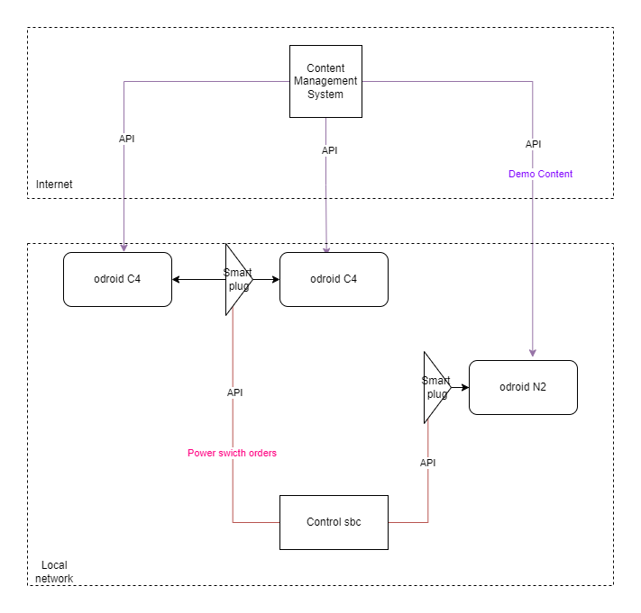

Architecture
============
Demos are hosted on SBCs

   General architecture

Some smart plug are connected to multiple SBCs. Some are connected to only one SBC.
Here we represent only three SBC but there are more in the T&E centre.

.. autosummary::
   :toctree: generated

   lumache
